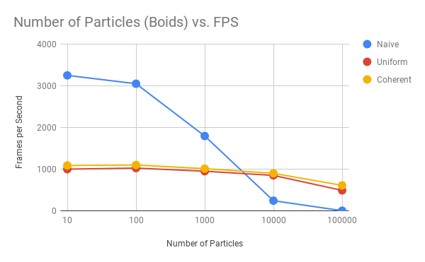
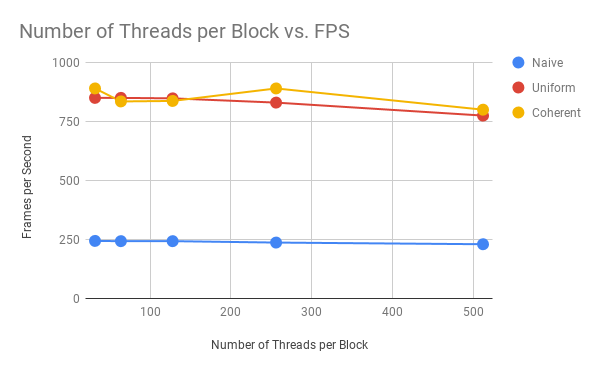

**University of Pennsylvania, CIS 565: GPU Programming and Architecture,
Project 1 - Flocking**

* Liam Dugan
  * [LinkedIn](https://www.linkedin.com/in/liam-dugan-95a961135/), [personal website](http://liamdugan.com/)
* Tested on: Windows 10, Ryzen 5 1600 @ 3.20GHz 16GB, GTX 1070 16GB (Personal Computer)

# Boid Flocking
See INSTRUCTION.md for an explanation of the flocking algorithm

# Questions
### For each implementation, how does changing the number of boids affect performance?

 
* NOTE: Test carried out with block size 128

For a small number of Boids, the Naive approach dominates. This is likely due to the Naive approach having significantly less computational overhead. However when the number of Boids becomes large, the Naive approach is completely eclipsed by the Uniform Grid and Coherent Grid implementations. This is because, while they may be slower than Naive on the worst case, these two implementations only check the particles in the neighboring grid cubes, which is highly likely to be much less than the total number of particles.

### For each implementation, how does changing the block count and block size affect performance?

* NOTE: Test carried out with 10,000 Particles (Boids)

For a small number of threads and a large number of blocks, the performance stays generally the same. A block size of 32, 64, and 128, all perform similarly across the algorithms. However, when we start to get to very large block size we start to see a noticeable drop in performance. 

This is likely due to the way we structured our program. In our algorithm if our thread index is larger than the number of particles (N), we return. This essentially leaves any thread with index > N sitting doing nothing. Therefore in order to optimize this algorithm we need to aim to have almost exactly N threads on each task. Since a block size of 512 would only allow us to add threads in increments of 512, we would run the risk of going over N by a significant amount and wasting resources in the process.

### Did you experience any performance improvements with the more coherent uniform grid? Was this the outcome you expected? Why or why not?

Yes I experienced a noticeable performance improvement with the coherent grid. While is it counterintuitive for this to be the faster option (extra movement of data just to save one pointer dereference), it makes sense when you think about the larger context of the GPU and its bottlenecks. 

The largest bottleneck for the GPU is memory access and so we want our algorithm to do as few pointer dereferences as possible. When we shuffle the data to make it coherent, we are doing 2 * N pointer dereferences (per buffer) in order to save 1 dereference (per buffer) every time a neighbor point is accessed in the future flocking algorithm. Thus in order for the coherent approach to be worthwhile we need to average at least 2 neighbors per point, which we achieve as the number of particles in the simulation becomes large.

### Did changing cell width and checking 27 vs 8 neighboring cells affect performance? Why or why not?

While changing the cell width to be 1/2 the search radius would allow you to avoid checking an unnecessarily large search area for neighboring points, the extra overhead it would create during the other steps of the algorithm (multiplying length of grid cell start/end index buffers by 8) would nullify any benefit it could have in all but the most extreme worst case scenarios. 
